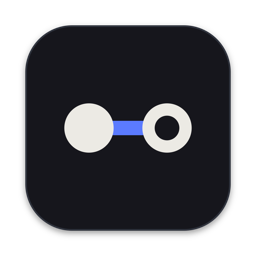
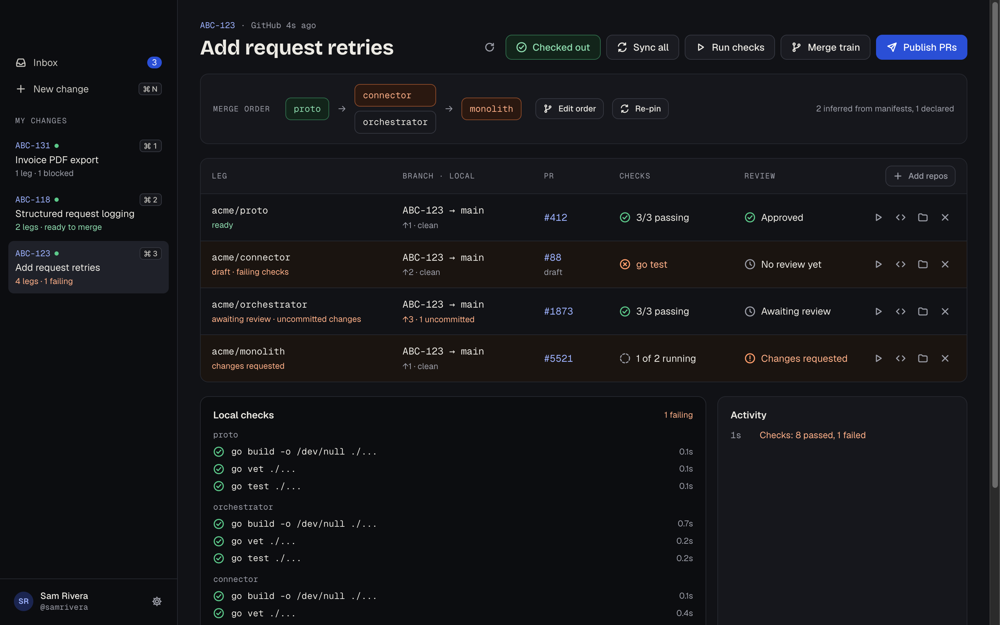
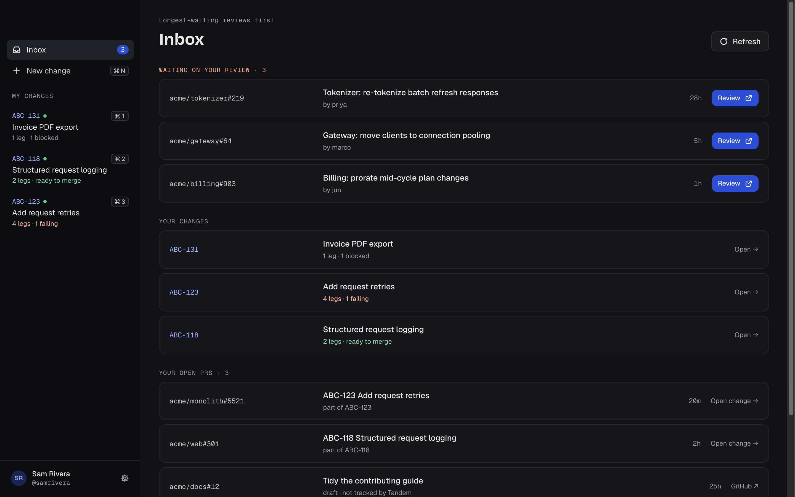
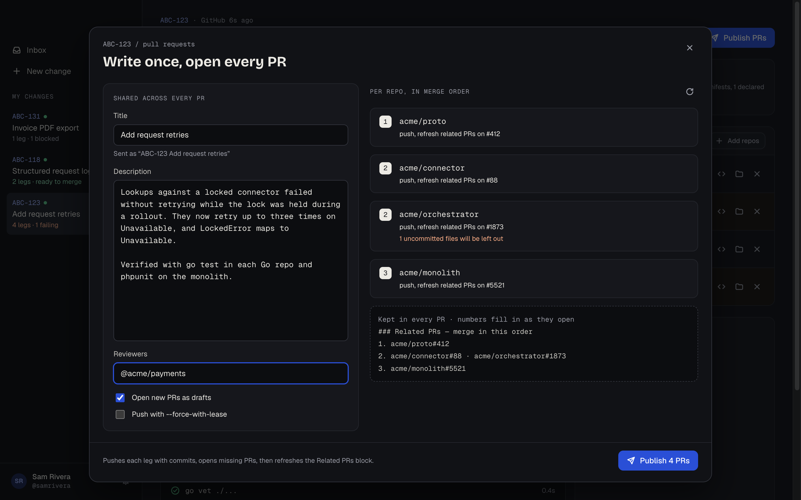
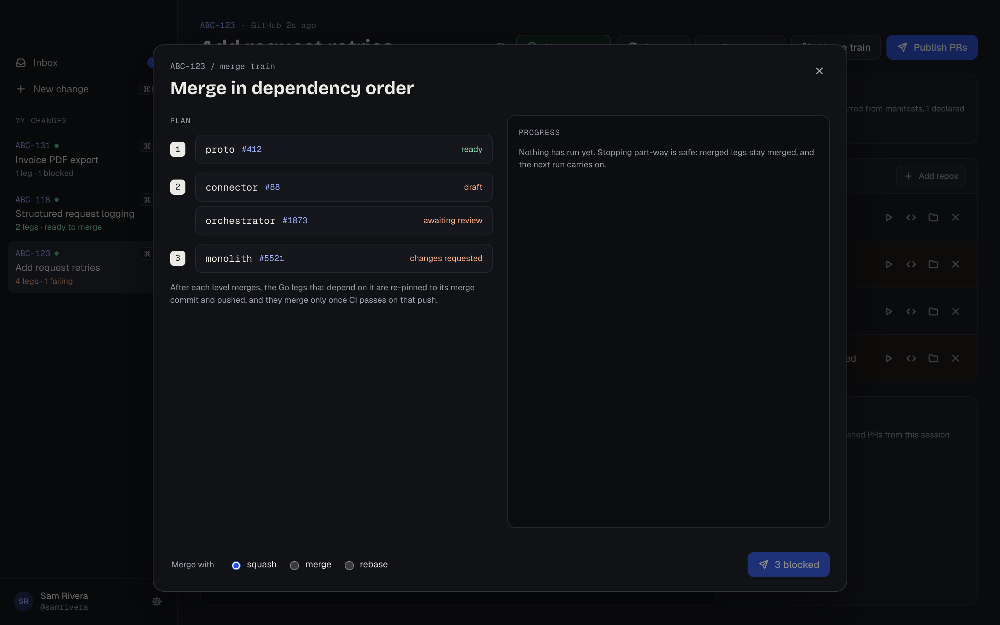
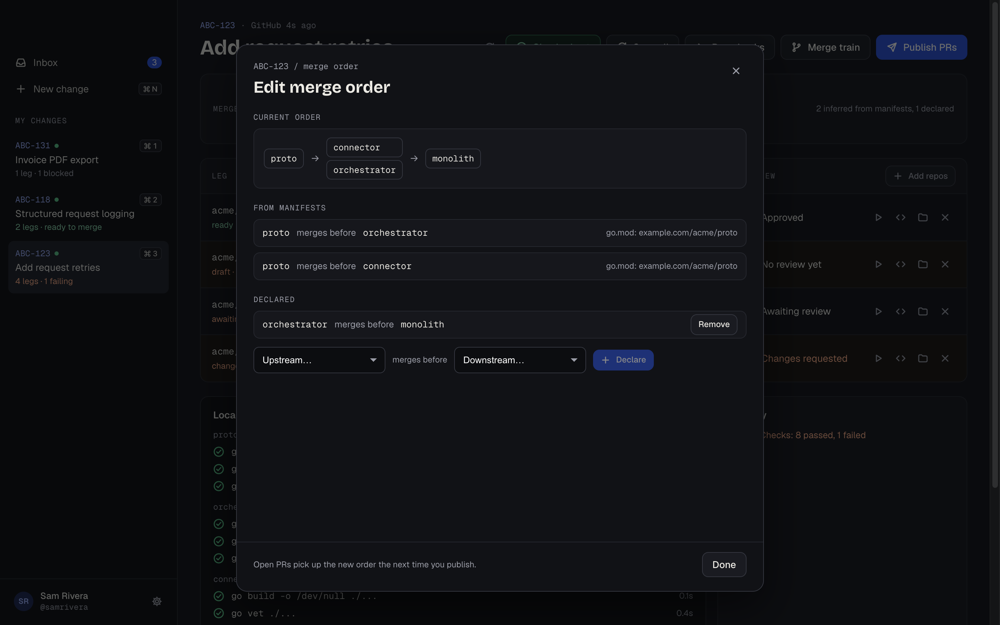
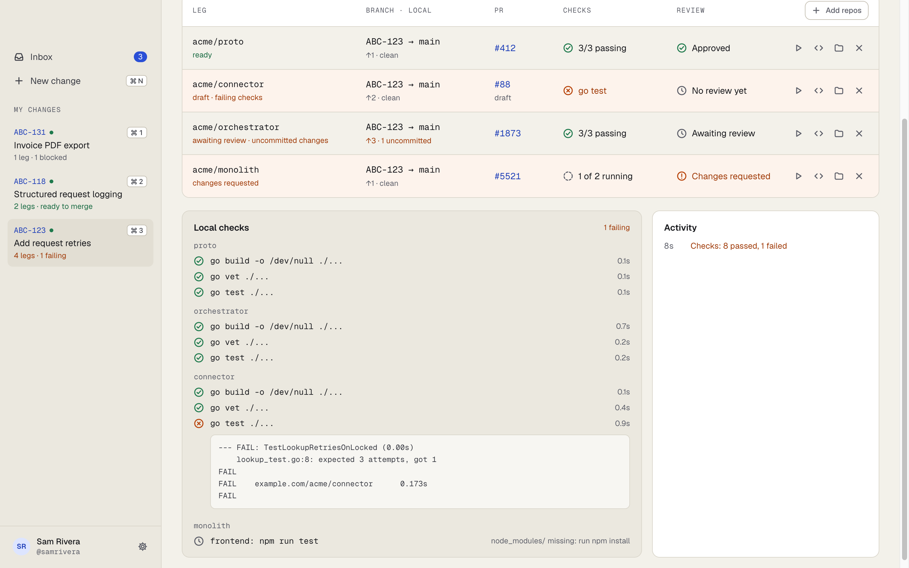
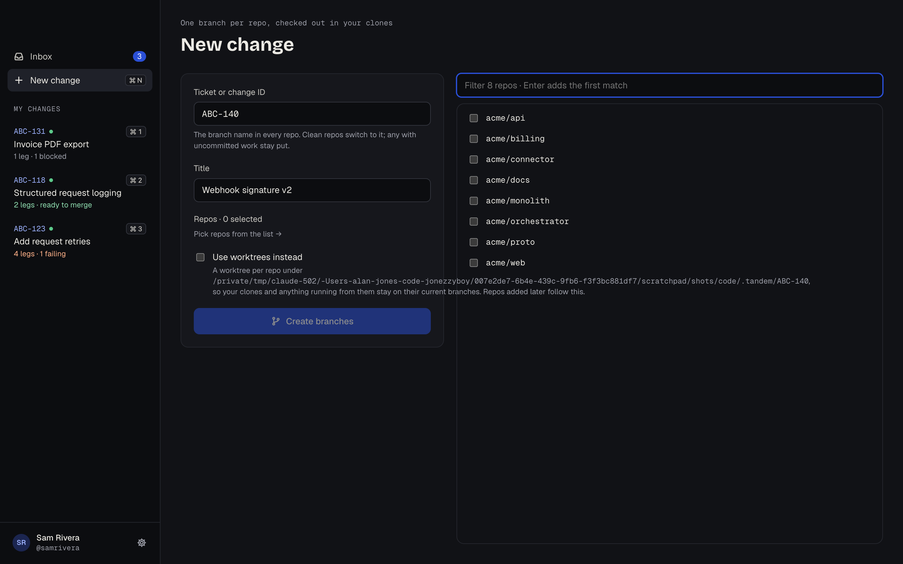
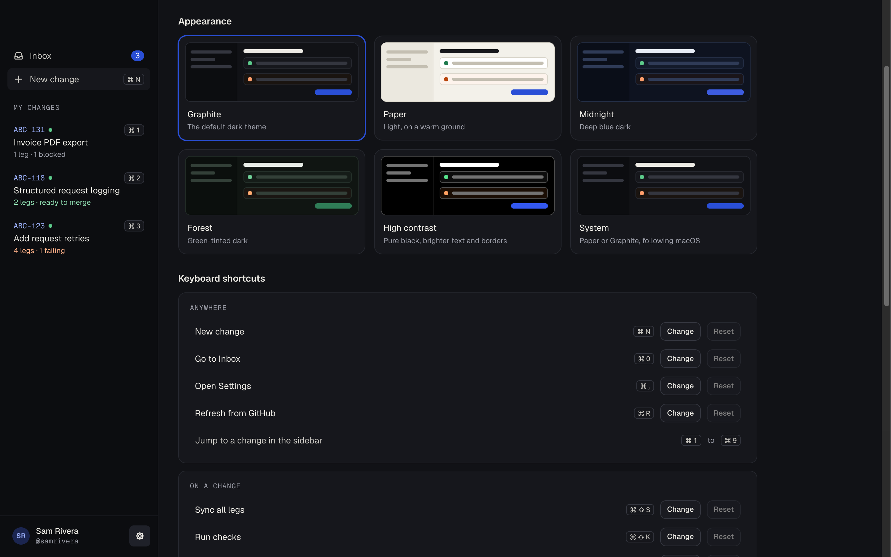
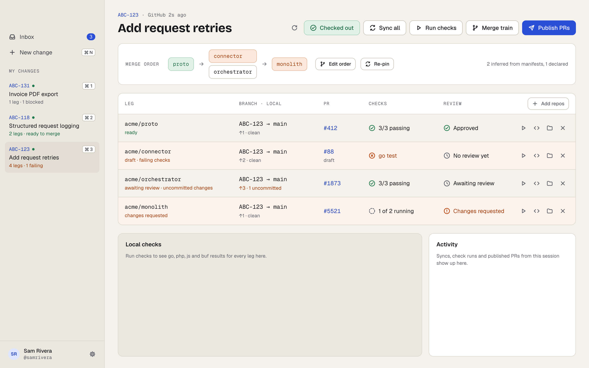

<p align="center">
  
</p>

<h1 align="center">Tandem</h1>

<p align="center">
  <strong>One change, many repos, moving together.</strong><br>
  A macOS app and CLI for changes that span several repositories: one branch everywhere,<br>
  PRs opened and cross-linked in one go, and merges landing in dependency order.
</p>

<p align="center">
  <a href="https://github.com/Jonezzyboy/tandem/releases/latest"></a>
  
  
</p>

```sh
brew install --cask Jonezzyboy/tandem/tandem-repos
```



## Why

A single piece of work often touches a protobuf repo, two Go services and a PHP
monolith. That means the same branch made four times, four PRs written by hand
and linked to each other, CI checked in four tabs, and remembering which one has
to merge first. Then you bump a `go.mod` after the upstream lands, and do it
all again.

Tandem makes the **change**, not the repo, the thing you work on:

- **One branch, every repo.** Start a change and each repo gets its branch from a
  freshly fetched `main`, checked out in the clone, so local services run the
  change's code. Or ask for a worktree per repo instead.
- **Merge order worked out for you,** from `go.mod`, `composer.json` and
  `package.json`, with anything the manifests can't see declared by hand.
- **Write the PR once.** Every repo gets its PR, and each one carries a "Related
  PRs, merge in this order" section that Tandem keeps up to date.
- **A merge train** that merges level by level, re-pins downstream Go modules to
  the merge commit, and waits for CI on the new pin before merging it.
- **Everything in one place:** each repo's local state, PR, CI and review, the PRs
  waiting on you, and local Go, PHP, JS and buf checks run across every repo at once.

## A tour

### Your inbox

Review requests, longest-waiting first, then your changes and your open PRs. PRs
that belong to a change open that change.



### Write once, open every PR

One title, description and reviewer list for the whole change. Each repo shows
what will happen before anything is pushed, including uncommitted files that
would be left out.



### Merge in dependency order

The train checks every PR first, so drafts, missing approvals and red CI stop it
before anything merges. Then it merges level by level. Stopping part-way is
safe: running it again carries on.



### Change the plan as you go

Forgot a repo? **Add repos** gives it the branch and slots it into the merge
order as soon as another repo depends on it. **Edit order** shows where each
edge comes from and lets you declare the ones no manifest knows about yet.



### Local checks across every repo

`go build`, `go vet` and `go test`, phpstan and phpunit, your `package.json`
scripts, and `buf lint`, run for every repo at once, with the output of anything
that fails.



### New changes, themes and settings

<table>
  <tr>
    <td width="50%"></td>
    <td width="50%"></td>
  </tr>
  <tr>
    <td>Pick repos from everything under <code>~/code</code>, and choose branches or worktrees.</td>
    <td>Six themes, shortcuts you can re-record, and the right IDE per language.</td>
  </tr>
</table>



## Install

```sh
brew install --cask Jonezzyboy/tandem/tandem-repos
gh auth login   # once, if gh isn't signed in yet
```

- **Contents:** the cask installs **Tandem.app** and the **`td` CLI**, at the same
  version. It's universal (Apple Silicon and Intel), and it pulls in `gh`.
- **Updates:** `brew upgrade --cask tandem-repos`.
- **Use the full name.** A bare `brew install --cask tandem` gets homebrew-cask's
  unrelated Tandem (a virtual office app). homebrew-core's `td` formula (a to-do
  list) also installs a `td` command, so uninstall it first.
- **Signing:** the app is ad-hoc signed, not notarised, so the cask clears the
  quarantine flag on install to avoid a Gatekeeper prompt.

For the CLI alone, or on Linux, run
`go install github.com/jonezzyboy/tandem/cmd/td@latest`, or use a `td_*` archive
from the [releases](https://github.com/Jonezzyboy/tandem/releases). Both the app
and the CLI need `git` and an authenticated `gh`.

## Quick start

**In the app:** click **New change**, give it an ID (your ticket, e.g. `ABC-123`)
and a title, pick the repos, and create it. Commit in your repos as usual. Then:

- **Publish PRs** opens every PR, cross-linked.
- **Run checks** runs local checks everywhere.
- **Merge train** merges in dependency order when they're approved.
- **Check out** puts every repo back on this change's branch after you've been
  elsewhere.

**From the terminal:**

```sh
td start ABC-123 proto orchestrator connector monolith --title "Add request retries"
# ...commit in each repo as usual...
td status              # where every repo stands, in merge order
td check               # local checks in every repo
td pr --draft          # push and open every PR, cross-linked
td merge               # merge in dependency order (shows the plan, then asks)
td clean               # tidy up once everything has landed (asks first)
```

```text
$ td status
ABC-123  Add request retries  3 of 4 legs blocked
  #  LEG           LOCAL       PR         CHECKS         REVIEW
  1  proto         ↑1 clean    #412       ✓ 3/3          approved
  2  connector     ↑2 clean    #88 draft  ✗ go test      —
  2  orchestrator  ↑3 1 dirty  #1873      ✓ 3/3          awaiting review
  3  monolith      ↑1 clean    #5521      ◌ 1/2 running  changes requested
```

Inside one of a change's repos you can leave out the ID. A repo in several
changes picks the one it has checked out.

## How it works

- **A change** is a ticket-like ID, which is also the branch name, plus a title
  and a set of repos. It's stored in `~/code/.tandem/<ID>/change.json`
  (`$TANDEM_HOME`).
- **Each leg** is one repo's part in the change: its branch, its PR and its
  checks. Repos are found as `<vendor>/<repo>` under `~/code` (`$TANDEM_ROOT`).
- **Branches or worktrees:**
  - **Branches (the default):** the branch is checked out in the repo's own clone,
    so services running from it pick the change up. A repo with uncommitted work
    gets the branch but stays where it is. `td switch` (or **Check out**) moves
    every repo onto the change, and `td switch --base` moves them back to `main`.
  - **Worktrees (`td start --worktree`, or the toggle on New change):** each repo
    gets a worktree under the change's folder instead, and your clones don't move.
    Repos added later follow the change's mode.
- **Merge order** is recomputed from the manifests each time, plus edges you
  declare with `td link`. A repo that provides a package another requires merges
  first. Cycles are refused.
- **PRs** each carry a Related PRs section between
  `<!-- tandem:related -->` markers. Publishing rewrites only that section, never
  your description.

## Commands

| Command | What it does |
|---|---|
| `td start <ID> <repo>... [--title T] [--worktree]` | Create a change: a branch per repo, checked out (or a worktree each). |
| `td add [ID] <repo>...` | Add repos to a change; the merge order updates. |
| `td remove [ID] <repo>...` | Take repos out of a change. Their branches stay. |
| `td switch [ID] [--base]` | Check out the change's branch in every repo, or with `--base` their main branch. |
| `td status [ID] [--offline]` | Local state, PR, CI and review for every repo, in merge order. |
| `td check [ID] [repo...]` | Run local checks, all repos at once. |
| `td sync [ID]` | Fetch every repo and rebase the clean ones onto their base. |
| `td pr [ID] [--title] [--body \| --body-file] [--draft] [--reviewer a,b] [--dry-run]` | Push, open or update PRs, and refresh the Related PRs section in all of them. |
| `td link` / `td unlink [ID] <upstream> <downstream>` | Declare or remove a merge-order edge. |
| `td pin [ID] [--no-commit]` | Point downstream Go repos at their upstream's pushed commit. |
| `td merge [ID] [--method squash\|merge\|rebase] [--dry-run] [--yes]` | Run the merge train. |
| `td clean [--yes]` | Switch landed changes back to base and delete their branches. |
| `td path [ID] [repo]`, `td list`, `td version` | Where a repo is, every change, the version. |

`td merge` and `td clean` ask before acting, and need `--yes` when there's no
terminal to ask on.

<details>
<summary><strong>The merge train in detail</strong></summary>

**Preflight.** It checks every PR first. Drafts, missing approvals and failing
checks stop the train before anything merges. Failing CI is tolerated on a repo
the train will re-pin, since the pin is often the fix.

**Then, level by level:**

1. Wait for the repo's CI to finish green, merge it (`--method squash` by
   default, or `merge` / `rebase`), and wait for GitHub to report it merged.
2. For each Go repo that requires a module just merged, `go get` it at the merge
   commit, commit `go.mod` and `go.sum`, and push. That repo merges only once CI
   has passed on the pushed commit.

**Stopping part-way.** Ctrl-C, a red check or a timeout leaves merged repos
merged, and the next `td merge` skips them and carries on. Composer and npm
dependencies order the train but aren't re-pinned.

**Pinning on its own.** `td pin` does step 2 without merging, against the
upstream's pushed branch (`td pr` pushes it). Private modules need `GOPRIVATE`
set as usual.

</details>

<details>
<summary><strong>Cleaning up</strong></summary>

`td clean` (or **Review cleanup** in the Inbox) lists every change whose PRs
have all merged or closed, with exactly what it would do:
- which repos it would switch back to their base;
- which local branches it would delete;
- which files it would remove.

Nothing happens until you confirm. A change with uncommitted or unpushed work,
or a PR still open, is kept and the reason shown. The branch of a PR that closed
unmerged is also kept.

</details>

<details>
<summary><strong>Local checks</strong></summary>

Detected from the repo root and its immediate subfolders:

| Found | Runs |
|---|---|
| `go.mod` | `go build -o /dev/null ./...`, `go vet ./...`, `go test ./...` |
| `composer.json` + `phpstan.neon(.dist)` / `phpunit.xml(.dist)` | `vendor/bin/phpstan analyse`, `vendor/bin/phpunit` |
| `package.json` scripts `typecheck`, `lint`, `test` | `<npm\|pnpm\|yarn> run <script>` with `CI=true` |
| `buf.yaml` | `buf lint` |

Checks that need `vendor/` or `node_modules/` show as skipped until you install.
A `.tandem.yml` at the repo root replaces detection:

```yaml
checks:
  - name: phpunit
    dir: backend
    run: vendor/bin/phpunit --testsuite unit
```

</details>

<details>
<summary><strong>Settings, editors and shortcuts</strong></summary>

Open Settings with ⌘, or the gear next to your account in the sidebar. It
covers:
- **Themes:** Graphite, Paper, Midnight, Forest, High contrast, or System to
  follow macOS.
- **Keyboard shortcuts:** click **Change** and press the new keys.
- **Editors:** which app opens each language.
- **Defaults:** the merge method, and whether new PRs open as drafts.

**Open in editor** picks by the repo's manifest (`go.mod` is Go, `composer.json`
is PHP, `package.json` is JS/TS, with root files winning over subfolders). It
opens GoLand, PhpStorm or WebStorm by default. You can choose any installed
editor or a custom command per language, and Other covers everything else and
is the fallback when a chosen app is missing.

| Shortcut | Action |
|---|---|
| ⌘N / ⌘0 / ⌘, / ⌘R | New change / Inbox / Settings / refresh |
| ⌘1–⌘9 | Jump to a change |
| ⌘⇧O | Check out the change in every repo |
| ⌘⇧S / ⌘⇧K | Sync all / run checks |
| ⌘⇧P / ⌘⇧M | Publish PRs / merge train |

Settings are saved to
`~/Library/Application Support/com.alanjones.tandem/settings.json`, and
`TANDEM_CONFIG_DIR` overrides the folder.

</details>

## Development

```sh
go test ./...                                # CLI and core
scripts/build-app.sh                         # desktop/build/bin/Tandem.app, with td inside
cd desktop && wails dev                      # the app with hot reload
cd desktop && go test ./...                  # needs frontend/dist: build the app or run npm run build first
```

The desktop app needs the Wails CLI: `go install github.com/wailsapp/wails/v2/cmd/wails@v2.16.0`.

**Layout.**
- `internal/core` computes a change's state and runs its operations.
- `cmd/td` → `internal/cli` and `desktop/` (Wails, with a Svelte frontend) both
  render it.
- `desktop/` is its own Go module, so the CLI never links Wails.
- The app serves each change from a cache and refreshes in the background: local
  git state every 4s for the change on screen, and GitHub every minute.

**Releasing.** A published GitHub release triggers
`.github/workflows/release.yml`. It builds the `td` archives and the universal
app on macOS 26, attaches them to the release, and rewrites `Casks/tandem-repos.rb`
in [homebrew-tandem](https://github.com/Jonezzyboy/homebrew-tandem).

```sh
scripts/set-version.sh 0.9.0
git commit -am "Release 0.9.0" && git push
gh release create v0.9.0 --generate-notes
```

**Release requirements:**
- The tag must read `v<version>`, matching `desktop/wails.json` and
  `desktop/frontend/package.json`.
- The app must link against the macOS 26 SDK. An older SDK makes macOS 26 draw it
  with legacy window chrome, so the workflow refuses to build.
- The workflow needs a `TAP_TOKEN` secret with write access to the tap.

The screenshots use dummy data: `acme/*` repos and a fictional user.
